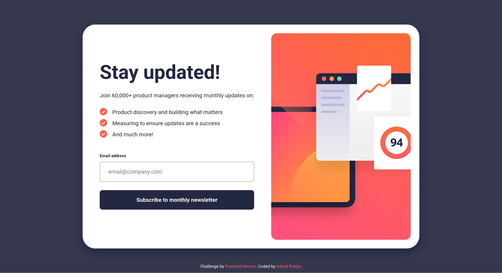

# Frontend Mentor - Newsletter sign-up form with success message solution

This is a solution to the [Newsletter sign-up form with success message challenge on Frontend Mentor](https://www.frontendmentor.io/challenges/newsletter-signup-form-with-success-message-3FC1AZbNrv). Frontend Mentor challenges help you improve your coding skills by building realistic projects.

## Table of contents

- [Overview](#overview)
  - [The challenge](#the-challenge)
  - [Screenshot](#screenshot)
  - [Links](#links)
- [My process](#my-process)
  - [Built with](#built-with)
  - [What I learned](#what-i-learned)
  - [Continued development](#continued-development)
  - [Useful resources](#useful-resources)

**Note: Delete this note and update the table of contents based on what sections you keep.**

## Overview

### The challenge

Users should be able to:

- Add their email and submit the form
- See a success message with their email after successfully submitting the form
- See form validation messages if:
  - The field is left empty
  - The email address is not formatted correctly
- View the optimal layout for the interface depending on their device's screen size
- See hover and focus states for all interactive elements on the page

### Screenshot

### Links

- Solution URL: [Newsletter Sign-up form](https://www.frontendmentor.io/solutions/responsive-newsletter-sign-up-form-with-html-scss-js-and-vite-Q-i-kcZHvy)
- Live Site URL: [Newsletter Sign-up form](https://fem-newsletter-sign-up-with-success-message.vercel.app/)

## My process

### Built with

- Semantic HTML5 markup
- CSS custom properties
- Flexbox
- Mobile-first workflow
- [Vite](https://vite.dev/guide/) - Vite build

### What I learned

1. How to hide and show elements based on button clicks and including responsiveness.
2. How to style buttons with clicks and validate data.
3. How to style buttons with a gradient.
4. How to reuse classes to style the same components.

### Continued development

1. Technique of laying out the container/wrappers for the main components and making them responsive.
2. Using SCSS to distribute my code and reusing it wherever I can.

### Useful resources

- [Button Gradient Background](https://codepen.io/alexkmarshall/pen/YzyEpPV) - Helped me with styling buttons.
- [Github Repo](https://github.com/DocForLoop/newsletter-sign-up-with-success-message) - Helped me with styling card-success component.
- [Media Query Breakpoints for SCSS](https://stackoverflow.com/a/67353943/21487404) - Helped me creating a mixin for breakpoints.
